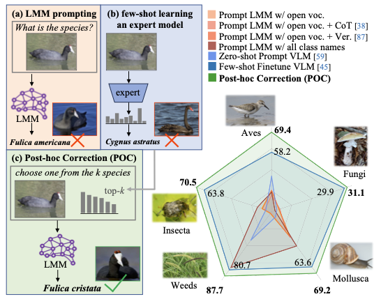

<div align="center">
<h1>Surely Large Multimodal Models (<em>Don't</em>) Excel<br>in Visual Species Recognition?</h1>

[**Tian Liu**](https://tian1327.github.io/)<sup>*1</sup> · [**Anwesha Basu**](https://www.linkedin.com/in/anweshabasu98/)<sup>*1</sup> · [**James Caverlee**](https://people.engr.tamu.edu/caverlee/index.html)<sup>1</sup> · [**Shu Kong**](https://aimerykong.github.io/)<sup>2</sup>

<sup>1</sup>Texas A&M University&emsp;&emsp;&emsp;<sup>2</sup>University of Macau
<br>
*The first two authors contribute equally. 

<a href="https://arxiv.org/abs/2512.15748"></a>
<a href='https://tian1327.github.io/POC/'></a>
</div>


We explore the capability of Large Multimodal Models (LMMs) in visual species recognition, a challenging fine-grained visual classification task. Surprisingly, we find that LMMs still struggle with this task, falling far behind a specialized few-shot recognition expert model. Yet, by leveraging the `top-k predictions` from the expert model to guide LMMs through in-context learning, we can significantly enhance VSR performance. Our method, **Post-hoc correction (POC)**, achieves state-of-the-art results on multiple VSR benchmarks, outperforming prior few-shot methods by >10% accuracy. Importantly, POC **requires no extra training, validation, or manual intervention**, serving as a `plug-and-play` module to significantly enhance various existing FSL methods.

<div align="center">



</div>

## News

- **2025-12-16:** POC code is released.
- **2025-12-10:** arXiv preprint is published.

<!-- - **2025-12-06:** We release pre-created `laion400m.db` file for easy retrieval. See [RETRIEVAL.md](./retrieval/RETRIEVAL.md).
- **2025-05-27:** SWAT is accepted to 4th CVinW and FGVC12 workshops at CVPR'25! 
- **2025-02-26:** SWAT is accepted to CVPR 2025! ;)
- **2025-01-18:** We provide access to our retrieved data through URLs. See [RETRIEVAL.md](./retrieval/RETRIEVAL.md).
- **2024-11-24:** Updated code base to include more datasets.
- **2024-08-22:** Retrieval code released, see [RETRIEVAL.md](./retrieval/RETRIEVAL.md).
- **2024-07-05:** SWAT finetuning code released.
- **2024-06-28:** [project page](https://tian1327.github.io/SWAT/) launched.
- **2024-06-17:** [arXiv paper](https://arxiv.org/abs/2406.11148) released. -->


<!-- --- -->

## Create Environment

Create conda environment and install dependencies.

```bash
# lab server has CUDA version 12.8, thus using pytorch-cuda=12.1 for compatibility
# DINOv3 requries python=3.10

conda create -n poc python=3.10 -y
conda activate poc
conda install pytorch torchvision torchaudio torchmetrics pytorch-cuda=12.1 -c pytorch -c nvidia

# install openclip and clip
pip install open_clip_torch
pip install git+https://github.com/openai/CLIP.git

pip install pandas scikit-learn 

# clone dinov3
git clone https://github.com/facebookresearch/dinov3.git

# install gdown for downloading datasets
pip install gdown
```

For LMM inference with Qwen, you can follow [instructions](https://github.com/QwenLM/Qwen2.5-VL) or steps below to set up Qwen2.5-VL-7B locally.

```bash
# setup Qwen2.5-VL-7B locally using huggingface transformers
conda create --name qwen --clone poc
conda activate qwen
pip install transformers==4.51.3 accelerate
pip install qwen-vl-utils[decord]
```


## Dataset Prepraration

Prepare the datasets following the instructions in [DATASETS.md](./DATASETS.md).
The few-shot splits are provided in the `data/${dataset_name}/few-shot${num_shots}_seed${seed}.txt` files, the test splits are in `data/${dataset_name}/test.txt`.
You can simply just download the datasets without repeating the sampling process.


## Code Usage

1. Obtain the top-k predictions on the test set using a few-shot finetuned model.

```bash
# activate conda environment
conda activate poc

# few-shot linear probing
bash scripts/run_dataset_seed_probing.sh semi-aves 1

# few-shot finetuning
bash scripts/run_dataset_seed_fewshot_finetune.sh semi-aves 1

# obtain top-k predictions on test set for a pretrained model
bash scripts/run_dataset_seed_topk.sh semi-aves 1

# we can also run batch experiments for multiple datasets and seeds
bash scripts/batch_probing.sh
bash scripts/batch_fewshot_finetune.sh
bash scripts/batch_topk.sh

# run other FSL baselines, we will release more FSL baselines soon
bash scripts/batch_cmlp.sh
```


For running ```FineR```, follow the command given below. Note this is just FineR and not POC on top of FineR. You can change the number of shots to 4, 8 or 16. Update the ```train_list``` and ```output_json``` arguments accordingly.

```bash
# Activate your environment
conda activate poc

# Obtain FineR predictions. 
python finer_topk.py \
  --model_cfg ViT-B-32 \
  --pretrained laion400m_e32 \
  --device cuda \
  --dataset_name semi-aves \
  --dataset_root_train ../path/to/your/semi-aves/ \
  --dataset_root_test  ../path/to/your/semi-aves/ \
  --train_list data/semi-aves/fewshot4_seed1.txt \
  --test_list  data/semi-aves/test.txt \
  --metrics_json data/semi-aves/semi-aves_labels.json \
  --name_key most_common_name \
  --use_random_aug --aug_repeats 10 --encode_chunk_size 512 \
  --alpha 0.7 \
  --logit_scale_eval 1.0 \
  --logit_scale_export 50 \
  --batch_size 256 --workers 8 \
  --topk 10 \
  --output_json ../path/to/your/fineR_semi-aves_4shot_topk_fused.json
```

2. Query LMM for post-hoc correction.

```bash
conda activate qwen

cd post-hoc_correction/lmm-inference

# run the query script
```
See [QUERYLMM.md](./QUERYLMM.md) for instructions on running query with each LMM. 


## Related Works

Check out our related works below:
- [SWIFT](https://tian1327.github.io/SWIFT/) (arXiv 2025): enabling successful semi-supervised learning with VLM
- [VEST](https://hannawang09.github.io/projects/vest/) (arXiv 2025): retriving open data for validation in few-shot learning
- [SWAT](https://tian1327.github.io/SWAT/) (CVPR 2025): retrieving open data for few-shot finetuning a VLM
- [REAL](https://shubhamprshr27.github.io/neglected-tails-of-vlms/) (CVPR 2024): uncovering the failures and causes in zero-shot VLMs

## Citations

If you find our project useful, please consider citing our works:

```bibtex
@article{liu2025poc,
title={Surely Large Multimodal Models (Don’t) Excel in Visual Species Recognition?}, 
author={Liu, Tian and Basu, Anwesha and Kong, Shu},
journal={arXiv preprint arXiv:2512.15748},
year={2025}
}

@article{liu2025swift,
title={Solving Semi-Supervised Few-Shot Learning from an Auto-Annotation Perspective}, 
author={Liu, Tian and Basu, Anwesha and Kong, Shu},
journal={arXiv preprint arXiv:2512.10244},
year={2025}
}

@article{wang2025enabling,
title={Enabling Validation for Robust Few-Shot Recognition}, 
author={Wang, Hanxin and Liu, Tian and Kong, Shu},
journal={arXiv preprint arXiv:2506.04713},
year={2025}
}

@inproceedings{liu2025few,
    title={Few-Shot Recognition via Stage-Wise Retrieval-Augmented Finetuning},
    author={Liu, Tian and Zhang, Huixin and Parashar, Shubham and Kong, Shu},
    booktitle={Proceedings of the IEEE/CVF Conference on Computer Vision and Pattern Recognition (CVPR)},
    year={2025}
}

@inproceedings{parashar2024neglected,
    title={The Neglected Tails in Vision-Language Models},
    author={Parashar, Shubham and Lin, Zhiqiu and Liu, Tian and Dong, Xiangjue and Li, Yanan and Ramanan, Deva and Caverlee, James and Kong, Shu},
    booktitle={Proceedings of the IEEE/CVF Conference on Computer Vision and Pattern Recognition (CVPR)},
    year={2024}
}
```
